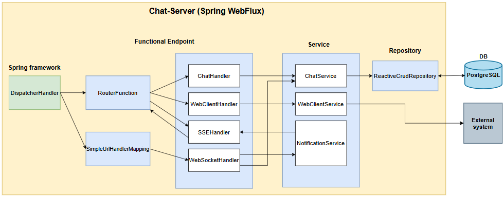

# Spring WebFlux 기반 비동기 채팅 서버

## 프로젝트 개요

Spring WebFlux를 활용한 실시간 채팅 애플리케이션으로, 비동기·논블로킹 방식의 고성능 서버 구현을 목표로 합니다.

### 주요 목표
- Spring WebFlux 기반 비동기·논블로킹 서버 구현
- 실시간 메시지 및 알림 전송 기능 구현  
- WebClient를 활용한 비동기 클라이언트 구현
- 함수형 프로그래밍 패러다임 적용

---

## 기술 스택

| 분야 | 기술 |
|------|------|
| **Framework** | Spring Boot 2.7.8, Spring WebFlux |
| **Database** | PostgreSQL, R2DBC |
| **Communication** | WebSocket, SSE (Server-Sent Events) |
| **Documentation** | Swagger UI, OpenAPI 3 |
| **Runtime** | Java 8, Netty |

---

## 시스템 아키텍처



### 핵심 컴포넌트 흐름

| 기능 | 처리 흐름 | 비고 |
|------|-----------|------|
| **REST API** | `ChatHandler` → `ChatService` → `Repository` | 채팅방/메시지 CRUD |
| **실시간 메시지** | `WebSocketHandler` → `SessionManager` | WebSocket 기반 실시간 통신 |
| **실시간 알림** | `SSEHandler` → `NotificationService` | Server-Sent Events |
| **외부 API** | `WebClientHandler` → `WebClientService` | 비동기 외부 시스템 연동 |

### 주요 기능

**실시간 채팅**
- WebSocket을 통한 실시간 메시지 송수신
- 채팅방별 세션 관리
- 접속자 실시간 현황 제공

**실시간 알림**  
- SSE(Server-Sent Events)를 통한 실시간 알림
- 채팅방 입장/퇴장 알림
- 새 메시지 도착 알림

**비동기 처리**
- Project Reactor 기반 비동기 데이터 처리
- R2DBC를 통한 비동기 데이터베이스 접근
- WebClient를 활용한 외부 API 비동기 호출

---

## 개발 환경 설정

### 1. 데이터베이스 설정 (Docker)

```bash
docker run --name PostgreSQL \
  -e POSTGRES_USER=root \
  -e POSTGRES_PASSWORD=dlab9185 \
  -e POSTGRES_DB=chat_app \
  -p 5432:5432 \
  -d postgres:latest
```

### 2. 애플리케이션 실행

```bash
# 프로젝트 클론 및 실행
./gradlew bootRun
```

### 3. API 문서 확인

- **Swagger UI**: [http://localhost:8080/swagger-ui.html](http://localhost:8080/swagger-ui.html)
- **OpenAPI JSON**: [http://localhost:8080/api-docs](http://localhost:8080/api-docs)

---

## 데이터베이스 설계


### 주요 테이블 구조

- **chat_room**: 채팅방 정보
- **chat_message**: 채팅 메시지 
- **chat_room_guest**: 채팅방 참여자 관리

**테이블 생성 스크립트**: `src/main/resources/schema.sql` 참고

---

## WebFlux 핵심 개념

### Reactive Programming
- **Mono**: 0 또는 1개의 데이터를 처리하는 Publisher
- **Flux**: 0개 이상의 다수 데이터를 처리하는 Publisher
- **Backpressure**: 데이터 흐름 제어를 통한 시스템 안정성 보장

### 비동기·논블로킹 처리
- 이벤트 루프 기반의 효율적인 리소스 활용
- 적은 스레드로 많은 동시 요청 처리 가능
- 높은 처리량과 낮은 레이턴시 달성

---

## 참고 자료

- [Spring WebFlux 공식 문서](https://docs.spring.io/spring-framework/docs/current/reference/html/web-reactive.html)
- [Project Reactor 가이드](https://projectreactor.io/docs/core/release/reference/)
- [R2DBC 사용 가이드](https://r2dbc.io/spec/0.8.6.RELEASE/spec/html/)