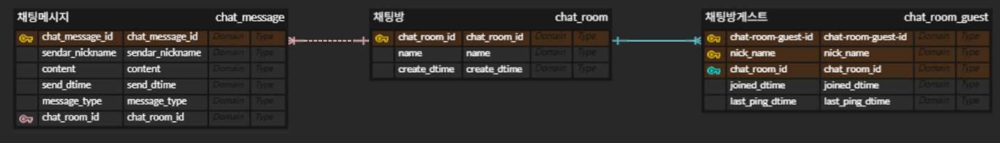

# Spring - WebFlux 기반 비동기 채팅 서버

## 1. WebFlux 주제 선정 배경

- 아직 경험하지 못한 Spring 기술을 활용 및 습득
- Java의 람다식, 함수형 인터페이스 등 함수형 프로그래밍 문법 사용
- 대규모 데이터 처리의 중요성과 고성능 유지 방안 (비동기 · 논블로킹)

---

## 2. 프로젝트 목표

- Spring WebFlux 기반 비동기 · 논블로킹 서버 구현
- 실시간 메시지 및 알림 전송 기능 구현
- WebClient 활용한 비동기 클라이언트 구현

---

## 3. 기술 스택

- **Backend**: Spring WebFlux, R2DBC, WebSocket
- **Database**: PostgreSQL
- **기타**: Project Reactor, WebClient

---

## WebFlux란?

Spring WebFlux는 Spring Framework 5.0 이상에서 도입된 **비동기 · 논블로킹 웹 프레임워크**입니다.  
**Project Reactor** 기반으로 동작하며, Reactive Streams 표준을 따릅니다.

### 주요 특징

- **비동기 · 논블로킹**: 적은 스레드로 많은 요청 처리
- **이벤트 루프 기반 모델**: 기본적으로 Netty 지원
- **함수형 프로그래밍**: Router Functions 등 지원
- **R2DBC 통합**: 비동기 데이터베이스 접근

> 대규모 트래픽 처리에 적합한 아키텍처

---

## Project Reactor

### 주요 특징

- **Reactive Streams 표준 준수**: `Publisher`, `Subscriber`, `Subscription`
- **핵심 타입**:
    - `Mono`: 0 또는 1개의 데이터
    - `Flux`: 0개 이상 다수의 데이터
- **연산자 체이닝**을 통한 데이터 스트림 처리
- **백프레셔** 지원
- **Scheduler**로 스레드 풀 관리 및 최적화

---

## 4. 시스템 구성도 및 기능 흐름


### 4-1 주요 기능 흐름

| 기능 구분 | 구성 요소                                                                                                       | 설명                        |
|----------|-------------------------------------------------------------------------------------------------------------|---------------------------|
| **채팅 CRUD** | `ChatHandler` → `ChatService` → `ReactiveCrudRepository` <br> `WebSocketHandler` → `ChatService` → `ReactiveCrudRepository`                                              | 채팅 테이블 관련 기본적인 CRUD <br> 실시간 메세지 처리중 테이블 CRUD |
| **실시간 메시지** | `WebSocketHandler` 에서 처리                                                                                    | WebSocket으로 실시간 메시지 전송    |
| **실시간 알림** | `SSEHandler` 호출하여 이벤트 스트림 연결 <br> 이 후 `WebSocketHandler`에서 이벤트 발생 시 `NotificationServerice` -> `SSEHandler` | SSE 기반 알림 전송 처리           |
| **외부 API 호출** | `WebClientHandler` → `WebClientService` -> `External System`                                                | 외부 시스템 연동 비동기 호출          |

---

## 5. 데이터베이스 설계 및 구축

### 5-1 DB 모델링

### 5-2 PostgreSQL 설치 (Docker)

```bash
docker run --name PostgreSQL \
  -e POSTGRES_USER=root \
  -e POSTGRES_PASSWORD=dlab9185 \
  -e POSTGRES_DB=chat_app \
  -p 5432:5432 \
  -d postgres:latest
```
### 5-3 테이블 생성 SQL
```sql
-- 채팅방
CREATE TABLE chat_room (
   chat_room_id SERIAL PRIMARY KEY,
   name VARCHAR(100) NOT NULL,
   create_dtime TIMESTAMP DEFAULT CURRENT_TIMESTAMP
);
-- 채팅 메시지
CREATE TABLE chat_message (
   chat_message_id SERIAL PRIMARY KEY,
   chat_room_id INT NOT NULL REFERENCES chat_room(chat_room_id) ON DELETE CASCADE,
   sender_nickname VARCHAR(100) NOT NULL,
   content TEXT NOT NULL,
   send_dtime TIMESTAMP DEFAULT CURRENT_TIMESTAMP
);
-- 채팅방 접속 게스트
CREATE TABLE chat_room_guest (
   chat_room_guest_id SERIAL PRIMARY KEY,
   nick_name VARCHAR(100) NOT NULL,
   chat_room_id INT NOT NULL REFERENCES chat_room(chat_room_id) ON DELETE CASCADE,
   joined_dtime TIMESTAMP DEFAULT CURRENT_TIMESTAMP,
   last_ping_dtime TIMESTAMP DEFAULT CURRENT_TIMESTAMP
);


```

## 6. 프로젝트 초기 환경 설정 
**스프링 버전 및 자바 버전은 DIMS와 동일하게 설정 후 진행하였음**
- **Spring Boot 버전**: `2.7.8`
- **Java 버전**: `JDK 1.8`

### 6-1 스프링 부트 프로젝트 생성 후 설정
#### ## application.yml 

```yaml
server:
  port: 8080
  title: CHAT-APP
  version: 1.0.0
  shutdown: graceful

spring:
  main:
    web-application-type: reactive
  lifecycle:
    timeout-per-shutdown-phase: 20s
  r2dbc:
    url: r2dbc:postgresql://localhost:5432/chat_app
    username: root
    password: dlab9185

springdoc:
  api-docs:
    path: /api-docs
  swagger-ui:
    path: /swagger-ui.html
    operations-sorter: method
    tags-sorter: alpha


api:
  base-url:
    urls:
      dims-dev: http://fbc.digitalab.co.kr:18080/dims-dev-service
      dims-prod: http://fbc.digitalab.co.kr:18080/dims-service
```

#### ## build.gradle 의존성 설정 

```gradle
dependencies {
	// R2DBC 의존성. 비동기 방식의 데이터베이스 연동을 제공
	implementation 'org.springframework.boot:spring-boot-starter-data-r2dbc'

	// Spring Web 포함시키면 Tomcat (Servlet 기반)으로 websocket이 동작한다. netty위에서 동작해야함
	//implementation 'org.springframework.boot:spring-boot-starter-web'

	// Spring WebFlux의 핵심 의존성, 리액티브 웹 애플리케이션 개발을 위한 기본 기능을 제공
	implementation 'org.springframework.boot:spring-boot-starter-webflux'

	// Spring WebSocket을 사용한 비동기 웹 소켓 통신을 위한 의존성
	//implementation 'org.springframework.boot:spring-boot-starter-websocket' // 주석이유 : spring-boot-starter-webflux에 WebSocket이 내장되어 있음.

	// PostgreSQL JDBC 드라이버, R2DBC의 runtime 의존성
	runtimeOnly 'org.postgresql:postgresql'

	// R2DBC PostgreSQL 드라이버, PostgreSQL 데이터베이스와 비동기 연결을 위한 드라이버
	runtimeOnly 'org.postgresql:r2dbc-postgresql'

	// Reactor 라이브러리의 테스트 기능, 리액티브 프로그래밍을 테스트하기 위한 유틸리티 제공
	testImplementation 'io.projectreactor:reactor-test'

	// Swagger UI와 OpenAPI 문서화를 위한 라이브러리. Spring WebFlux와 통합하여 API 문서화 가능
	implementation 'org.springdoc:springdoc-openapi-webflux-ui:1.6.15'

	compileOnly 'org.projectlombok:lombok'
	annotationProcessor 'org.projectlombok:lombok'
	testCompileOnly 'org.projectlombok:lombok'
	testAnnotationProcessor 'org.projectlombok:lombok'
	developmentOnly 'org.springframework.boot:spring-boot-devtools'
	testImplementation 'org.springframework.boot:spring-boot-starter-test'
	testRuntimeOnly 'org.junit.platform:junit-platform-launcher'
}

```